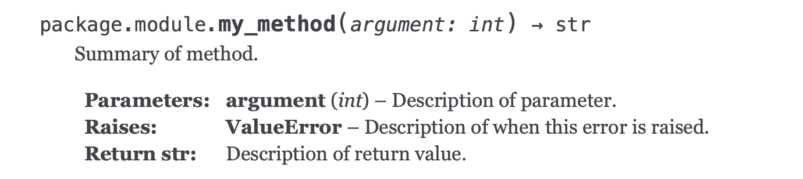
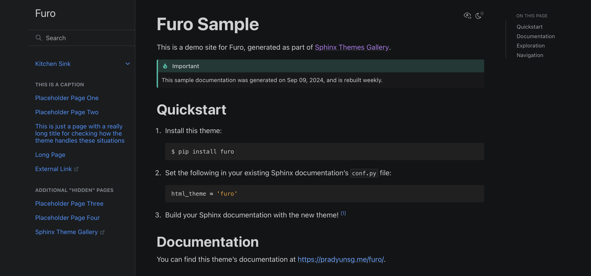

Under 10 minutes? Yes. (if you've already been diligent about adding docstrings to your codebase).

Documentation is both written and read—how can we make both of these processes as effortless as possible? Docs must be easy to write and maintain, otherwise devs won't want to maintain them. In an ideal world, documentation is written in a *single place*, yet is accessible from *everywhere*. It should also be easy to read and search, so that consumers can quickly find the information they need.

There are many pre-existing solutions for generating documentation from source code, but Sphinx is by far the most ubiquitous for Python development. Even still, Sphinx can be a huge pain to set up. The following sections lay out the fastest way to get your project documented (I was able to generate a polished docs site in under 10 minutes with these instructions).

## Prerequisites and Requirements

Before we discuss how we'll create auto-generating docs, let's go over the requirements for our solution:

- Must be able to auto-generate documentation directly from Python source code.
- Must be able to pull the project's markdown README.md into the documentation site's homepage, so that project documentation only has to be written in one place.
- Docstrings must be in a format intelligible by VS Code (specifically, the Pylance LSP) so that method and class definitions appear in a formatted manner on method/class mouse hover.
- Run within a Poetry project environment
- Dependencies must only be installed within the Poetry environment to enable a great distributed VCS developer environment with versions of dev dependencies enforced across all project members.

## Setup

1. Install VS Code extensions
    - [autoDocstring](https://marketplace.visualstudio.com/items?itemName=njpwerner.autodocstring) – to automatically generate docstrings for functions
    - [reStructuredText](https://marketplace.visualstudio.com/items?itemName=lextudio.restructuredtext) – language server support
    - [Esbonio](https://marketplace.visualstudio.com/items?itemName=swyddfa.esbonio) – to preview your Sphinx doc site preview from within VS Code
    - [Python Docstring Highlighter](https://marketplace.visualstudio.com/items?itemName=rodolphebarbanneau.python-docstring-highlighter) – to highlight Sphinx-style docstrings in source code
2. Add dependencies ([sphinx](https://www.sphinx-doc.org/en/master/), [sphinx-autoapi](https://sphinx-autoapi.readthedocs.io/en/stable/), [myst-parser](https://myst-parser.readthedocs.io)):

    ```sh
    poetry add sphinx sphinx-autoapi myst-parser --group dev
    ```

3. Run `poetry run sphinx-quickstart` from the project root directory
    - `Separate source and build directories (y/n) [n]: y`
4. In the generated `Makefile`, modify the `SPHINXBUILD` value to run scripts from the Poetry virtual environment:
    - `Makefile`:

      ```diff
      - SPHINXBUILD ?= sphinx-build
      + SPHINXBUILD ?= poetry run sphinx-build
      ```

    - `make.bat`:

      ```diff
        if "%SPHINXBUILD%" == "" (
      -     set SPHINXBUILD=sphinx-build
      +     set SPHINXBUILD=poetry run sphinx-build
        )
      ```

5. In the generated `source/conf.py`:
    - Add `extensions = ["autoapi", "myst_parser"]` to automatically import your source code where sphinx can read it, and to include your project's markdown README in your generated documentation site.
    - Add `autoapi_dirs = ["../your_module_name"]`, replacing `your_module_name` with whatever your source directory is.
    - Customize options. I added the following to only display public class members, programmatically: `autoapi_options = ["members", "undoc-members", "show-inheritance", "show-module-summary"]`.
6. In the generated `source/index.rst`, add the following content:

    ```rst
    [Project Title] Documentation
    ================================
    
    .. toctree::
      :maxdepth: 4
      :caption: Contents:
    
    .. include:: ../README.md
      :parser: myst_parser.sphinx_
    ```

    The bottom `include` directive will automatically pull in our project's README as our documentation site's homepage, so that we only have to specify project documentation in a single place.
7. Create a file `.vscode/settings.json`, and place the following content in it:

    ```json
    {
      "autoDocstring.docstringFormat": "one-line-sphinx",
      "autoDocstring.includeExtendedSummary": true
    }
    ```

8. Add docstrings to methods in your Python source. I choose one-line Sphinx style, e.g.,

    ```python
    def my_method(argument: int) -> str:
        """Summary of method.
        
        :param int argument: Description of parameter.
        :raises ValueError: Description of when this error is raised.
        :return str: Description of return value.
        """
        if argument < 0:
            raise ValueError

        return f"Your argument is: {argument}"
    ```

    which renders as:

    

9. Run `make html` to generate documentation.
10. View your documentation...
    - In your browser from the root directory with `open build/html/index.html`
    - To the side in VS Code by entering [^K V] (via Esbonio extension)

## Custom Themes

Everyone knows the classic [Alabaster](https://sphinx-themes.org/sample-sites/default-alabaster/) theme, but there's so many great (and potentially more modern-looking) themes [available](https://sphinx-themes.org). I'm personally a fan of Pradyun Gedam's [Furo](https://github.com/pradyunsg/furo) theme, which also provides a light/dark mode feature.

Installation is a breeze: simply add your theme as a dependency:

```sh
poetry add furo --group dev
```

, then modify your `source/conf.py` to use it:

```python
html_theme = "furo"
```


