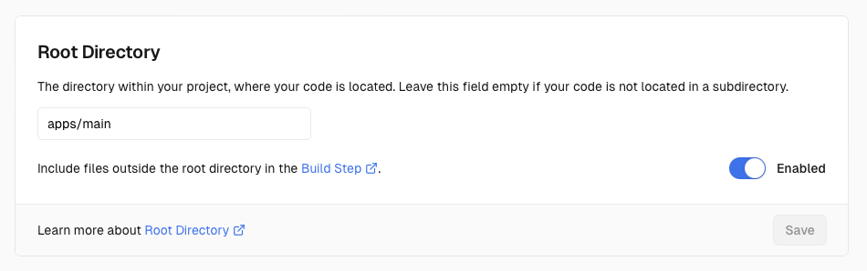

This article is for you if...

- You want to have one cohesive site to navigate around subdomains with, e.g.,
  - `blog.yoursite.io` (instead of `yoursite.io/blog`)
  - `contact.yoursite.io` (instead of `yoursite.io/contact`)
  - etc.
- You're using Svelte/SvelteKit (it'll likely be similar for other frameworks, but good to note).
- You want all your code to be hosted in a single GitHub repo.
- Your hosting is on Vercel.
- You aren't interested in or can't use a pre-built solution like [Turborepo](https://turbo.build/repo) or [Nx](https://nx.dev). Honestly, I was very interested in using Nx, but as of the time of writing (July 15, 2024), Nx only supported Svelte and not SvelteKit.

## Example Repo

Want to skip the talk and see for yourself? This website you're actively reading is using the monorepo setup described in these instructions; see the repo [here](https://github.com/camball/camball.io).

## Repo Structure

We'll be following a monorepo structure—i.e., one repository that contains multiple projects. For my use case, I have multiple subdomains under `mysite.io` that will all be treated as their own "projects", even though they're all really just pages under my site that will link between each other. Functionally, they will be independent, but may share some Svelte components if needed.

Instead of having a top-level `src/` directory, we'll have a top-level `apps/` directory. `apps/` will contain directories containing a shared directory (`lib`) and subdirectories for each subproject:

```txt
apps
├── blog
│   ├── src
│   │   └── ...
│   ├── svelte.config.js
│   ├── tsconfig.json
│   └── vite.config.ts
├── lib
│   └── assets
│       └── example-image.jpeg
└── main
    ├── src
    │   └── ...
    ├── svelte.config.js
    ├── tsconfig.json
    └── vite.config.ts
```

, where `blog/` will hold the code to be deployed to `blog.mysite.io` and `main/` holds the code to be deployed to `mysite.io`.

Notice that each subproject gets its own `svelte.config.js`. I found this to be the only solution for that configuration file, so it's what we're going with. To properly map `apps/lib/` to be the value of [`$lib`](https://kit.svelte.dev/docs/modules#$lib) in SvelteKit, I had to define `config.kit.files.lib` in each `svelte.config.js` as simply `../lib`.

To make importing assets super simple (following help from [here](https://stackoverflow.com/a/75191716/14708097)), I installed [svelte-preprocess-import-assets](https://www.npmjs.com/package/svelte-preprocess-import-assets) (more on usage later). The only setup I had to perform here was adding its `importAssets()` call in each `svelte.config.js`'s preprocess list: `preprocess: [vitePreprocess(), importAssets()]`.

My final `svelte.config.js` ended up as the following:

```js
import adapter from '@sveltejs/adapter-auto';
import { vitePreprocess } from '@sveltejs/vite-plugin-svelte';
import { importAssets } from 'svelte-preprocess-import-assets';

/** @type {import('@sveltejs/kit').Config} */
const config = {
 preprocess: [vitePreprocess(), importAssets()],

 kit: {
  adapter: adapter(),
  files: {
   lib: '../lib'
  },
 }
};

export default config;
```

### Asset Handling

Originally, I was storing all images under the template-provided root-level `static/` directory. In my new monorepo setup, under `lib`, I created an `assets` directory to contain assets for my entire site. Technically I could separate which assets are used by site, but I really would rather have all my assets in one central place for simplicity, so this is the route I'm taking for now. At the end of the day, I'm only going with a monorepo to separate my Vercel deployments by subdirectory to deploy subprojects to unique subdomains ***for aesthetic reasons***, lol. I just think `blog.mysite.io` looks better than `mysite.io/blog`, and I also think it's more memorable to users of my site. I digress.

As described in the above section, we installed [svelte-preprocess-import-assets](https://www.npmjs.com/package/svelte-preprocess-import-assets), and with our images stored in our `$lib/assets` directory, we can simply modify our code to use images in the following manner, no imports required:

```diff
- 
+ 
```

Unfortunately, I wasn't able to get that nice syntax working for the `href` of images in any non-Svelte files (i.e., my program entry, `app.html`), for importing favicons. I tried many setups and syntaxes, but the only thing I could get working was duplicating the originally root-level `static/` directory to each subproject root. With that setup, the value `%sveltekit.assets%` would resolve to this directory, just like it would in the non-monorepo setup.

### `.gitignore`

Simply,

```diff
- /.svelte-kit
+ /**/.svelte-kit
```

## Configuration

### Vite and Building

Each subproject needs its own `vite.config.ts`, so we'll just extend a common one into each subproject. I don't (currently) have any subproject-specific Vite setup, so I simply left my base `vite.config.ts` as is in my root directory and created one for each subproject with the following content:

```ts
import baseConfig from "../../vite.config";

export default baseConfig;
```

If I ever need to extend it down the line with custom configuration, I can use Vite's [`mergeConfig`](https://vitejs.dev/guide/api-javascript#mergeconfig) function.

To actually build our code, we need to modify our `package.json` scripts to individually build each project. We will later instruct each Vercel project to use the respective custom build script. I added scripts to build each subproject like:

```json
{
 ...,
 "scripts": {
  "build:main": "cd apps/main && vite build",
  "build:blog": "cd apps/blog && vite build",
  ...
 }
 ...
}
```

This could get pretty cumbersome, so I installed [`concurrently`](https://www.npmjs.com/package/concurrently) as a dev dependency and defined the `build` script to build all simultaneously:

```sh
npm i concurrently --save-dev
```

```json
{
 ...,
 "scripts": {
  "build": "concurrently --kill-others \"npm:build:*\"",
  "build:main": "...",
  "build:blog": "...",
  ...
 }
 ...
}
```

I followed the same structure for running `npm run lint` concurrently, but don't want to kill my computer, so for running `npm run dev`, I simply defined scripts for each subproject and no concurrent version:

```json
{
 ...,
 "scripts": {
  "dev:main": "cd apps/main && vite dev",
  "dev:blog": "cd apps/blog && vite dev",
  ...
 }
 ...
}
```

### `tsconfig.json`

I had a `tsconfig.json` in my root directory, and simply had to copy it to under each subproject directory with no modifications. I.e.,

```txt
apps
├── blog
│   ├── src
│   │   └── ...
│   └── tsconfig.json
└── main
    ├── src
    │   └── ...
    └── tsconfig.json
```

### `tailwind.config.ts`

I have a base tailwind config in my root directory with global configuration, as well as tailwind configs in each subproject directory. A minimal tailwind config used on subprojects that don't need custom tailwind configuration simply looks like:

```ts
import baseConfig from '../../tailwind.config';

export default baseConfig;
```

A truncated version of a subproject directory config that needed customisation looks like:

```ts
import baseConfig from '../../tailwind.config';

export default {
  ...baseConfig,
  exampleKey: 'an example custom value',
  theme: {
    ...baseConfig.theme,
    extend: {
      ...baseConfig.theme.extend,
      exampleNestedKey: 'another example custom value,
    },
  },
};
```

### Vitest

Simply create a file `vitest.workspace.ts` in the project root ([source](https://vitest.dev/guide/workspace)), populated with:

```ts
export default [
 'apps/*'
]
```

Now, `npm test` will work as expected when run from anywhere in your project, testing all subprojects simultaneously :)

## Hosting & DNS Record Configuration

After pushing to main, I immediately got a build failure as the root directory was not configured for our new monorepo structure. In Vercel's general settings, I simply had to [specify the proper root directory](https://vercel.com/docs/monorepos#using-monorepos-with-vercel-dashboard):



After this, I went to the failed deployment, clicked redeploy, and everything was smooth sailing, first try. That was fairly relieving, lol.

To deploy my blog subproject, `blog.mysite.io`, I...

1. Added a DNS CNAME record for `blog` under my main `mysite.io` domain
2. Created a new Vercel project. On setup...
3. I specified my install command (`npm install`) and my root directory, `apps/blog`
4. Once the Vercel project was initialised, I navigated to Settings > Domains and added my target domain to the list (`blog.mysite.io`)

With that, both `mysite.io` and `blog.mysite.io` were fully in business, and I could hit both live.
